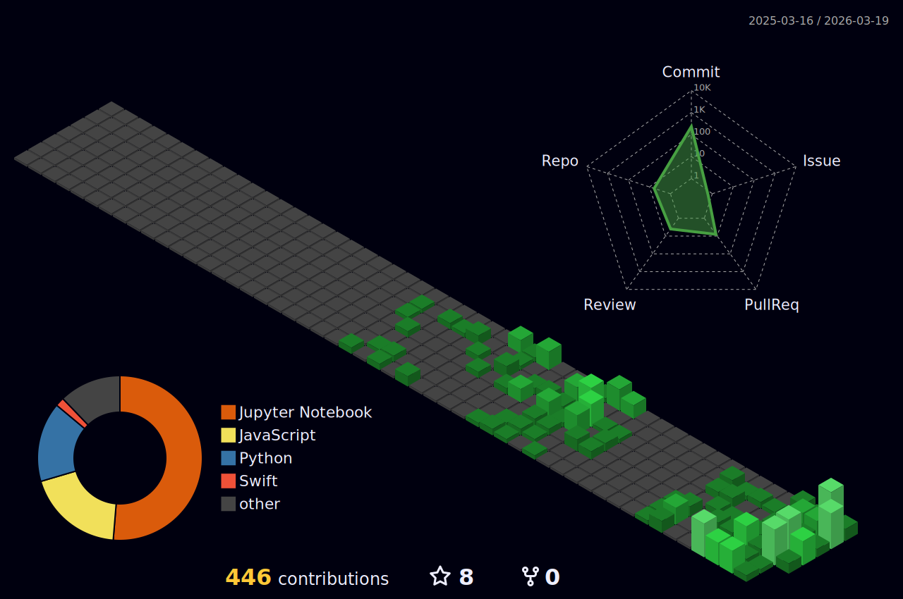

  

  

  
  
  
  
  
  
  

  

---

### 👨‍💻 About Me
I am a **Software Engineer** and **MS in AI Systems student at the University of Florida**, specializing in the development of high-performance, production-grade Machine Learning and Computer Vision systems.

With **2.5+ years of professional engineering experience**, I have transitioned from architecting complex distributed systems to focusing on the full-lifecycle engineering of **Intelligent Systems**. I treat model development as more than just an academic exercise; I focus on the engineering required to move a model from a research notebook into a robust, scalable, and real-time environment.

### 🧪 Technical Focus
- **Computer Vision (CV)**: Architecting real-time inference pipelines using **YOLO and MediaPipe** for high-frequency spatial tracking and object detection.
- **ML Engineering (MLE)**: Designing end-to-end pipelines that bridge the gap between model training in **PyTorch** and high-throughput, low-latency deployment.
- **System Reliability**: Leveraging a deep background in low-latency communication and secure infrastructures to build AI systems that are both performant and reliable under production loads.

### 🧠 Mathematical Foundations in AI
idge the gap between theory and implementation by applying core mathematical principles to my engineering workflows:

* **Optimization:** Minimizing loss functions via Gradient Descent:
  $$\theta_{t+1} = \theta_t - \eta \nabla J(\theta_t)$$

* **Neural Networks:** Computing layer activations:
  $$a^{(l)} = \sigma(W^{(l)}a^{(l-1)} + b^{(l)})$$

---

### 🛠️ Tech Arsenal

Here is the clean, optimized code ready for your GitHub README.md. I have polished the alignments and grouped the logic so it looks professional and balanced on both desktop and mobile views.

Markdown
### 🛠️ Tech Arsenal

**Languages**

  
  
  
  
  
  

**AI / ML / Data Science**

  
  
  
  
  
  
  
  

**Mobile & Frontend Development**

  
  
  
  
  
  
  
  
  

**Backend & Infrastructure**

  
  
  
  
  
  

**Observability, Testing & DevOps**

  
  
  
  
  
  

**Tools & IDEs**

  
  
  

---

### 🚀 Featured Projects

| Project | Description | Tech Stack |
| :--- | :--- | :--- |
| **⚽ JuggleIQ**| Real-time soccer juggling tracker using advanced Pose Estimation. | Python, OpenCV, YOLO, MediaPipe |
| **🧠 SummarIQ** | AI-powered PDF summarizer for scientific papers | Python, NLP, LLM |
| **🚢 Ship Detection** | Ship detection from satellite imagery | Python, PyTorch, CV |
| **🌦️ Weather Clima** | iOS weather app featuring live data integration | Swift |
| **🛡️ WiProtect** | iOS app to assess Wi-Fi security (WPA/WPA2/WPA3) | Swift |

---

### 🗺️ 3D Contribution Graph

  

---

### 📊 GitHub Stats

  
  &nbsp;
  

  

---

### 🐍 Contribution Snake

  <picture>
    <source media="(prefers-color-scheme: dark)" srcset="https://raw.githubusercontent.com/Satyabratadas/Satyabratadas/output/github-snake-dark.svg" />
    <source media="(prefers-color-scheme: light)" srcset="https://raw.githubusercontent.com/Satyabratadas/Satyabratadas/output/github-snake.svg" />
    
  </picture>

---

<!-- Footer Banner -->

  

  <b>Gainesville, Florida, USA</b> · <a href="mailto:satyabradas@ufl.edu">satyabradas@ufl.edu</a> · +1 786 636 5501 ·

